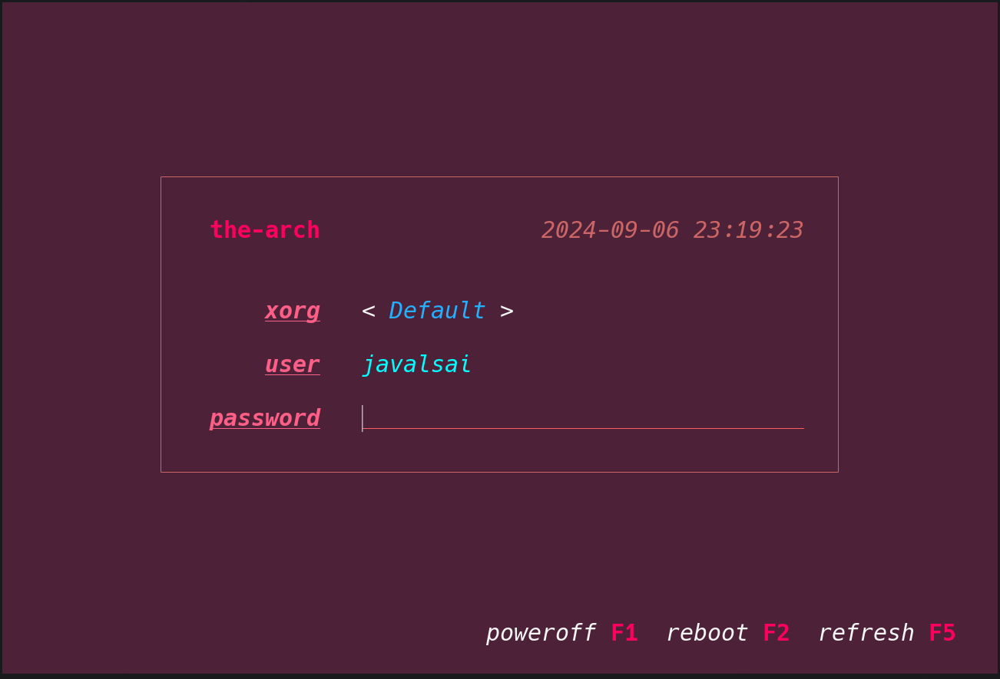

[](https://github.com/javalsai/lidm/blob/master/LICENSE)
[](https://github.com/javalsai/lidm)
[](https://github.com/javalsai/lidm/releases)

# LiDM
LiDM is a really light UI portion a unix [login manager](https://en.wikipedia.org/wiki/Login_manager) made in C, highly customizable and held together by hopes and prayers 🙏.

LiDM is like any [X Display Manager](https://en.wikipedia.org/wiki/X_display_manager) you have seen such as SDDM or GDM but without using X org graphics, instead being a purely [text based interface](https://en.wikipedia.org/wiki/Text-based_user_interface).


> *shown as in a featured terminal emulator, actual linux console doesn't support as much color and decorations*

> *however, all colors and strings are fully customizable*

## Features
* Builds **FAST**.
  * `a32e4a5`:
    * `2.830s`: laptop, -O3, -j2, `AMD E-450 APU with Radeon(tm) HD Graphics`
    * `0.172s`: desktop, -O3, -j12, `AMD Ryzen 5 5600G with Radeon Graphics`
  * `663427e`:
    * `0.085s`: desktop, -O0, `AMD Ryzen 5 5600G with Radeon Graphics`
    * `0.009s`: desktop, -O0, CC=tcc, `AMD Ryzen 5 5600G with Radeon Graphics`
* Works everywhere you can get gcc to compile.
* Fast and possibly efficient.
* Fully customizable, from strings, including action keys, to colors (I hope you know ansi escape codes)
* Automatically detects xorg and wayland sessions, plus allowing to launch the default user shell (if enabled in config)
* Starts with many init systems (systemd, dinit, runit, openrc and s6).

## WIP
* Desktop's file `TryExec` key.
* Save last selection.
* Show/hide passwd switch.
* Long sessions, strings, usernames, passwords... they will just overflow or fuck your terminal, I know it and I don't know if I'll fix it.
* UTF characters or any multi-byte character, not yet supported properly, everything treats characters as a single byte, some chars might work or not depending on the context, but it's not designed to.

# Index
- [LiDM](#lidm)
  - [Features](#features)
  - [WIP](#wip)
- [Index](#index)
- [Ideology](#ideology)
- [Usage](#usage)
    - [Arguments](#arguments)
    - [Program](#program)
- [Requirements](#requirements)
- [Installation](#installation)
  - [Manually](#manually)
  - [AUR](#aur)
- [Configuring](#configuring)
- [Contributing](#contributing)
- [Backstory](#backstory)
- [Contributors](#contributors)

# Ideology
We all know that the most important thing in a project is the ideology of the author and the movements he wants to support, so [**#stopchatcontrol**](https://stopchatcontrol.eu).

[  ](https://stopchatcontrol.eu)
> *there's also a [change.org post](https://www.change.org/p/stoppt-die-chatkontrolle-grundrechte-gelten-auch-im-netz).*


# Usage
### Arguments
If a single argument is provided (don't even do `--` or standard parsing...), it passes that argument to `chvt` on startup, used (at least) by most service files.

### Program
On top of pure intuition:
* You can change focus of session/user/passwd with up/down arrows.
* In case arrow keys do nothing on the focused input (Either is empty text or doesn't have more options), it tries to change session and if there's only one session it changes user.
* Typing anything will allow to put a custom user or shell command too, you can use arrow keys to move.
* ESC and then left/right arrows will force to change the option of the focused input, useful if you're editing the current input and arrow keys just move.
* Editing a predefined option on a user or a shell session, will put you in edit mode preserving the original value, other cases start from scratch.

# Requirements
* A computer with unix based system.
* That system should have the resources necessary for this program to make sense (Sessions, users...).
* A compiler (optional, you can compile by hand, but I doubt you want to see the code).
* Make (Also optional, but does things automatically, make sure `gcc` and `mkdir -p` work as expected).
* PAM, used for user authentication, just what `login` or `su` use internally. Don't worry, it's surely pre-installed.

# Installation
## Manually
* Build the package (you can download automatic builds from the [releases page](https://github.com/javalsai/lidm/releases)):
```sh
git clone https://github.com/javalsai/lidm.git
cd lidm
make # 👍
```
* Install the files (see [configuration](#configuring) for more theming info).
```sh
# place binary in /usr/bin and copy
# default theme to /etc
make install
```
* If you want lidm to run on startup ([manual steps](./assets/services/README.md)):
```sh
# automatically detects init system
# and installs service file (for tty7)
make install-service

# or if you don't like autodetection
make install-service-systemd # systemd
make install-service-dinit # dinit
# ...other supported init systems....
```

## AUR
[AUR packages](https://aur.archlinux.org/packages?K=lidm&SeB=n) will automatically install the binary and config. But I recommend reading [installing manually](#manually) to understand the install process.

> [!CAUTION]
> [service files](./assets/pkg/aur#services) have to be manually installed by now.

# Configuring
Copy any `.ini` file from [`themes/`](./themes/) (`default.ini` will always be updated) to `/etc/lidm.ini` and/or configure it to your liking. Also, don't place empty lines (for now). You can also set `LIDM_CONF` environment variable to specify a config path.

Configured colors are just gonna be put inside `\x1b[...m`, ofc you can add an 'm' to break this and this can f\*ck up really bad or even make some nice UI effect possible, you should also be able to embed the `\x1b` byte in the config as I won't parse escape codes, I think that the parser is just gonna grab anything in the config file from the space after the `=` (yes, I'ma enforce that space, get good taste if you don't like it) until the newline, you can put any abomination in there. But please, keep in mind this might break easily.

The default fg style should disable decorators set up in other elements (cursive, underline... it's just adding 20 to the number btw, so if cursive is 4 (iirc), disabling it is 24).

> [!TIP]
> If you don't like seeing an element, you can change the fg color of it to be the same as the bg, making it invisible.

# Contributing
If you want to contribute check the [CONTRIBUTING.md](docs/CONTRIBUTING.md)

# Backstory
Summer travelling to visit family with an old laptop that barely supports x86_64, and ly recently added some avx2 instructions I think (invalid op codes), manually building (any previous commit too) didn't work because of something in the `build.zig` file, so out of boredom I decided to craft up my own simple display manager on the only language this thing can handle... **C** (I hate this and reserve the right for the rust rewrite, actually solid).

I spedrun it in roughly 3 days and I'm bad af in C, so this is spaghetti code on **another** level. I think it doesn't do almost anything unsafe, I mean, I didn't check allocations and it's capable of reallocating memory until your username uses all memory, crashing the system due to a off-by-one error, but pretty consistent otherwise (probably).

The name is just ly but changing "y" with "i", that had a reason but forgot it, (maybe the i in *simple*), so I remembered this sh*tty laptop with a lid, this thing is also a display manager (dm, ly command is also `ly-dm`), so just did lidm due to all that.

# Contributors
[](https://github.com/javalsai/lidm/graphs/contributors)

* KillerTofus, [made the AUR package](https://github.com/javalsai/lidm/pull/2)! Saved me from reading the Arch Wiki 💀.
* DeaDvey, the most awesomest of all, did some pretty HARDCORE gramer checking. (and trolling, he wrote that, 33 commits of just readme changes ffs)
* grialion, made a simple C implementation of `chvt` instead of insecurely relying on `kbd utils`'s command.
* cerealexperiments_, found a missing newline (had the guts to read the source code, crazy ik)
* ChatGPT, in times of slow laptops where pages take ages to load, a single tab connected to a bunch of burning cloud GPUs feeding corporate hype is all you need to get quick answers for your questions, as long as you know how to filter AI crap ofc.
* [My lack of gf](https://www.instagram.com/reel/C8sa3Gltmtq), can't imagine this project being possible if somebody actually cared about me daily.
