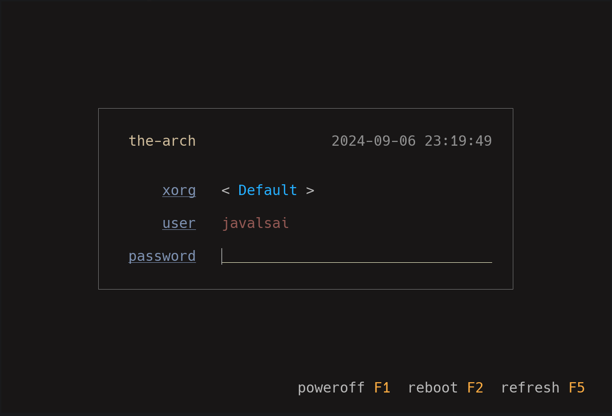
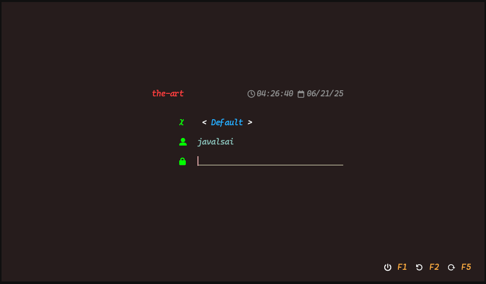
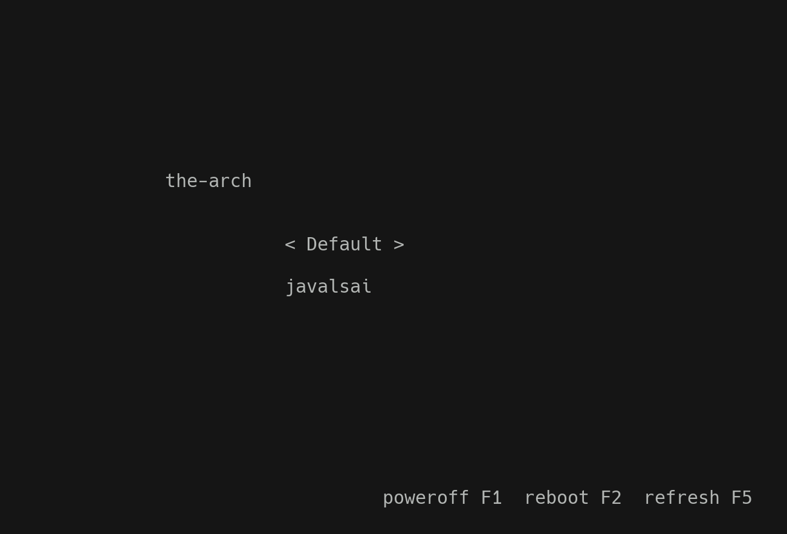

# Themes

## catppuccin-frappe.ini

## catppuccin-latte.ini

## catppuccin-macchiato.ini

## catppuccin-mocha.ini

## cherry.ini

## default.ini

## kanagawa-dragon.ini

## kanagawa-wave.ini

## minimal.ini

> [!WARNING]
> This theme **heavily** relies on terminal rendering. It's just to show
> customizability, a TTY won't render this properly

## nature.ini

## nord.ini

## old-blue.ini

## nothing.ini

## tasteless.ini

